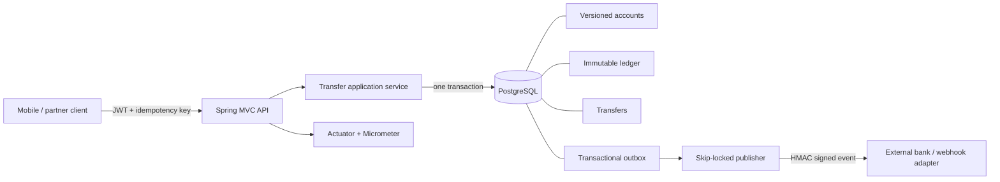

# Spring Payments Platform

An auditable payments reference implementation built to demonstrate the engineering decisions behind a reliable banking service: atomic balance changes, immutable double-entry records, replay-safe APIs, secure integration events, and operational visibility.

> This is a portfolio reference system, not a licensed banking product. It deliberately keeps the business surface small so the reliability mechanisms remain easy to inspect.

[](https://github.com/asim-altayb/spring-payments-platform/actions/workflows/ci.yml)
[](https://adoptium.net/)
[](https://spring.io/projects/spring-boot)

## Why this project exists

Payment code is not impressive because it has a `POST` endpoint. It is impressive when retries do not duplicate money movement, concurrent writes cannot silently corrupt balances, every transfer leaves a balanced audit trail, and downstream delivery can recover independently after a crash.

This repository makes those properties explicit and testable.

## Production signals

| Concern | Implementation |
|---|---|
| Atomic money movement | Spring transaction covers transfer, both account balances, ledger entries, and outbox event |
| Double-entry invariant | Exactly one debit and one credit per transfer, reinforced by database constraints |
| Replay safety | Client-scoped idempotency key with a unique database constraint |
| Concurrent writes | JPA optimistic versioning; caller can retry with the same idempotency key |
| Auditability | Append-only ledger protected from update/delete by a PostgreSQL trigger |
| Reliable integration | Transactional outbox with `FOR UPDATE SKIP LOCKED` batch claims |
| Webhook integrity | HMAC-SHA256 signatures using a rotatable external secret |
| API security | JWT resource server plus scope-based method authorization |
| Operations | Health probes, Prometheus metrics, structured logs, graceful shutdown |
| Schema ownership | Versioned Flyway migrations; Hibernate validates rather than creates schema |

## Architecture



The detailed boundaries and failure behavior are documented in [Architecture](docs/architecture.md), [Threat model](docs/threat-model.md), and [Operations runbook](docs/runbook.md). Decisions are captured as ADRs instead of being hidden in implementation folklore.

## Run locally

Requirements: Java 17+, Maven 3.6.3+, and Docker Compose.

```bash
docker compose up -d postgres
mvn spring-boot:run
```

Configuration is environment-driven:

```bash
export DB_URL=jdbc:postgresql://localhost:5432/payments
export DB_USER=payments
export DB_PASSWORD=payments
export JWT_SECRET='replace-with-at-least-32-random-bytes'
export WEBHOOK_SECRET='replace-with-a-separate-random-secret'
```

Generate a development JWT with scopes `accounts:write accounts:read transfers:write` (HS256, same secret as `JWT_SECRET`), then create two accounts and execute a transfer. The complete contract is available at [`/openapi.yaml`](src/main/resources/static/openapi.yaml).

Example scopes claim for local tokens: `"scope": "accounts:write accounts:read transfers:write"`.

```bash
curl -X POST http://localhost:8080/api/v1/transfers \
  -H "Authorization: Bearer $TOKEN" \
  -H "Content-Type: application/json" \
  -H "Idempotency-Key: order-2026-00042" \
  -d '{"sourceAccountId":"<uuid>","destinationAccountId":"<uuid>","amount":125.50,"currency":"SDG"}'
```

Repeat the same request with the same client and key: it returns the original transfer rather than moving money twice.

## Verify

```bash
mvn test
mvn verify
```

Unit tests cover money invariants and signatures. PostgreSQL integration tests use Testcontainers to verify migrations, idempotency, balanced ledger entries, balance updates, and outbox creation against a real database engine.

## Repository map

```text
src/main/java/dev/sudoasim/payments
├── account/    versioned aggregate and account API
├── transfer/   use case, ledger, idempotent transfer API
├── outbox/     reliable event claim and publication boundary
├── security/   JWT and scope policy
├── webhook/    HMAC signature boundary
└── common/     RFC 9457-style API errors
```

## Deliberate trade-offs

- Balances are materialized for fast reads while the immutable ledger remains the audit record. A production reconciliation job should continuously compare both.
- The included publisher logs the signed delivery boundary. A real deployment supplies an HTTP or broker adapter and records destination-level acknowledgements.
- Currency conversion is intentionally excluded. Transfers require matching ISO-style currency codes so exchange-rate risk is not hidden in a demo.
- The symmetric JWT decoder keeps local execution self-contained. Production should use an external issuer and asymmetric key rotation.

## License

Apache-2.0. Built by [Asim Abdalla](https://github.com/asim-altayb).

